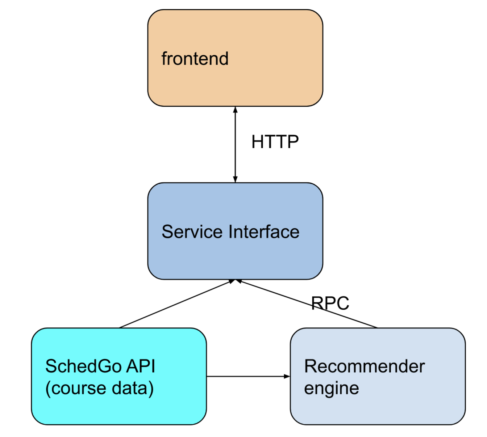

# General Architecture

design documents for the Course Recommender project

**NOTE** all content in the doc are open to discussion. Please use `Issue` for any question/concern.

## Table of Content

* [Frontend](./Frontend.md) @[JackyWangRechar ](https://github.com/JackyWangRechar)
* [Service Interface](./ServiceInterface.md) @[Yifeng He](https://github.com/EYH0602)@[JackyWangRechar ](https://github.com/JackyWangRechar)
* [Recommender Engine](./RecommenderEngine.md) @[Yifeng He](https://github.com/EYH0602)
* [SchedGo](https://schedgo.com/)

## Some Helpful Links

these links can help us build this project easier for educational purposes.

* [Simple Python HTTP Server](https://stackoverflow.com/questions/33652679/create-a-simplehttpserver-to-use-the-python-code-as-api)
* [Cosine Similarity for NLP Recommendation](https://towardsdatascience.com/using-cosine-similarity-to-build-a-movie-recommendation-system-ae7f20842599)

